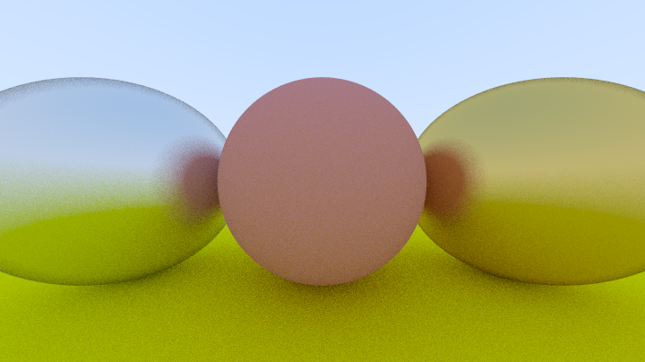

# raytracer

This is a raytracer based on the book
[Raytracing in one weekend](https://raytracing.github.io/books/RayTracingInOneWeekend.html).
By implementing the ideas & concepts from the book, I'm teaching myself
how do raytracers work in practice and what underlying principles and math are
used to create cool looking scenes.

Final result:

# Building the project
This project uses cmake as a build system. `CMakeLists.txt` should be utilized to generate cmake-related directory. For example, CLion IDE offers to pick the path to `CMakeLists.txt`
at the beginning of work:

`CMakeLists.txt` is located in `src/CMakeLists.txt`

Evolution of my journey:

A scene without antialiasing:

Antialiasing upper right neighbours:

Antialiasing all neighbour pixels:

Diffuse materials gamma correction:

Hemispherical scattering:

True lambertian reflection:

Metal with lambertian:

Fuzzed metal:

Depth of field effect:

Motion blur:

Texture Mapping

Final result:

